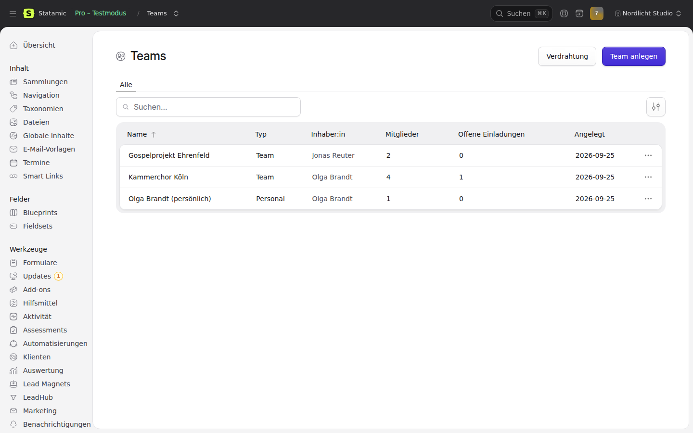

# Teams for Statamic

Workspaces with members. A team is a choir, a company, a household: people are in it with a role
that counts in that team only, they come in by invitation link or join code, and access or a
purchase can belong to the team instead of one person.

- Teams, memberships with a role and free `meta` per member, invitations (token stored only as a
  hash), join codes that survive being read aloud.
- Roles and permissions per team, not global. Statamic roles stay for the Control Panel.
- Middleware `teams.current`: which team a request is about, and that the user is in it.
  403 for a stranger, 422 for a request that names two different teams.
- A team is a subject in [statamic-entitlements](https://github.com/goldnead/statamic-entitlements):
  access granted to the team holds for every member and ends when they leave.
- A team is the buyer in [statamic-payments](https://github.com/goldnead/statamic-payments), with its
  own billing address.
- Every mail is a template in [statamic-email-templates](https://github.com/goldnead/statamic-email-templates).
- Every event is a trigger in automations and the webhook manager, and lands in the activity log.
- Personal team per user (optional), read-only teams, import with fixed ids for moving an existing app.

Works with Statamic's file users and Eloquent users alike.



## Requirements

- PHP 8.2+, Laravel 12.40+ or 13, Statamic 6.
- Users from Statamic's file repository or the Eloquent repository.
- Optional: statamic-brand-context (settings page), statamic-email-templates, statamic-entitlements,
  statamic-payments, statamic-automations, statamic-webhook-manager, statamic-activity.

## Installation

```bash
composer require goldnead/statamic-teams
php artisan migrate
```

Optional, when [email-templates](https://github.com/goldnead/statamic-email-templates) is installed:

```bash
php please teams:mail-templates   # writes the four mails into the templates collection
```

The Control Panel lists teams under **Users → Teams**. Permissions: `view teams`, `manage teams`,
`manage teams settings`.

## Usage

```php
use Goldnead\Teams\Facades\Teams;

$choir = Teams::create('Kammerchor Köln', $conductor, ['join_method' => 'join_code']);
Teams::invite($choir, 'alto@example.com', 'member', ['voice_part' => 'alto'], actor: $conductor);

// in a controller behind `teams.current`
$team = Teams::current();
abort_unless(Teams::can($request->user(), $team, 'invite members'), 403);
```

In Antlers, `{{ teams:switch_form }}`, `{{ teams:members }}`, `{{ teams:invite_form }}` and
`{{ teams:join_form }}` cover the usual account pages (see "Front end").

## Concepts

| | |
|---|---|
| **Team** | `Goldnead\Teams\Models\Team`: `id`, `uuid`, `name`, `type` (`team`, `personal`, or your own), `owner_id`, `join_method` (`invitation_only`, `join_code`), `join_code`, `settings`, `billing`. |
| **Membership** | One user in one team: `role`, `meta` (free fields, e.g. a voice part), `is_current`, `joined_at`. Users are stored by string key, so UUIDs (file users) and integers (Eloquent) both work. |
| **Invitation** | Addressed to an email, with a role and `meta` copied onto the membership. Expires (default 7 days), is bound to its address, works once. Inviting the same address again replaces the link. |
| **Role** | Defined in `teams.roles`; a team can add its own in `team_roles`. `owner` holds every permission and cannot be removed from the last owner. |

**Nobody hands out more than they hold.** Whoever assigns a role, invites into it or removes someone
holding it must hold every permission of that role; a role with `*` and the owner role only by an
owner. Changing one's own role, and demoting or removing an owner, is an owner's business. The
last-owner check runs inside the write's transaction with the owner rows locked. The same rule
covers editing someone else's membership fields (`updateMemberMeta`).

**An invitation grants what its sender may still give.** On acceptance, the person who invited must
still be in the team and hold every permission of the invited role. If not, the invitation is not
refused (the invitee acted in good faith) but grants only `default_role`; the team can raise it.
Invitations from the CP or an import (no sender) keep their role.

Nobody is put into a team without consent: the Control Panel and the front end invite, they do not add.
`Teams::addMember()` exists for code that has its own consent (an import, a checkout).

## Public API

Everything goes through the facade `Goldnead\Teams\Facades\Teams` (root: `Goldnead\Teams\TeamsManager`).
These are the operations statamic-app-api exposes as JSON.

Methods that change something take an optional `$actor`. With an actor (the signed-in user), the
actor's role in the team must allow it. Without an actor the call is trusted (CP, console, import).
A refusal is a `Goldnead\Teams\Exceptions\TeamsException` with a stable `reason` and an HTTP `status()`:

| reason | status | |
|---|---|---|
| `not_member` | 403 | actor or user is not in the team |
| `forbidden` | 403 | the role does not allow it |
| `already_member` | 422 | |
| `invitation_not_found` | 404 | |
| `invitation_expired`, `invitation_used`, `invitation_revoked` | 410 | |
| `invitation_wrong_email` | 403 | account email differs from the invited one |
| `join_code_invalid` | 404 | |
| `join_disabled` | 403 | team does not accept codes |
| `unknown_role`, `last_owner`, `already_owner`, `personal_team`, `team_mismatch`, `team_required` | 422 | |
| `import_collision` | 409 | a fixed id belongs to another team |
| `read_only` | 423 | |
| anything a join guard returns, e.g. `team_full` | 422 | |

```php
use Goldnead\Teams\Facades\Teams;

// Teams
Teams::create(string $name, $owner = null, array $attributes = []): Team   // type, join_method, settings, billing, meta
Teams::update(Team $team, array $attributes, $actor = null): Team          // name, join_method, settings (merged), billing (merged)
Teams::delete(Team $team, $actor = null): void
Teams::find(int|string $idOrUuid): ?Team
Teams::personalTeam($user): Team                                          // created on first use
Teams::regenerateJoinCode(Team $team, $actor = null): string
Teams::transferOwnership(Team $team, $to, $actor = null): Team            // old owner becomes admin

// Members
Teams::teamsOf($user): Collection
Teams::members(Team $team): Collection                                   // of Membership
Teams::addMember(Team $team, $user, ?string $role = null, array $meta = [], $actor = null): Membership
Teams::removeMember(Team $team, $user, $actor = null): void               // actor === user means leaving
Teams::leave(Team $team, $user): void
Teams::changeRole(Team $team, $user, string $role, $actor = null): Membership
Teams::updateMemberMeta(Team $team, $user, array $meta, $actor = null): Membership  // null removes a key

// Current team
Teams::current($user = null): ?Team        // the middleware's team, else the user's current one
Teams::currentOrFail($user = null): Team   // or TeamsException team_required (422)
Teams::switch($user, Team $team): Membership

// Invitations and codes
Teams::invite(Team $team, string $email, ?string $role = null, array $meta = [], $actor = null): IssuedInvitation  // ->invitation, ->token, ->url
Teams::invitation(string $token): Invitation          // peek, throws if no longer usable
Teams::acceptInvitation(string $token, $user): Membership
Teams::revokeInvitation(Invitation $invitation, $actor = null): Invitation
Teams::resendInvitation(Invitation $invitation, $actor = null): IssuedInvitation
Teams::pendingInvitationsFor($user): Collection       // addressed to the user's email
Teams::pendingInvitationsOf(Team $team): Collection
Teams::joinByCode(string $code, $user, array $meta = []): Membership
Teams::guardJoining(Closure $guard): void             // fn (Team $team, string $userKey, string $via): ?string reason

// Roles
Teams::can($user, Team $team, string $permission): bool
Teams::roleOf($user, Team $team): ?string
Teams::roles(?Team $team = null): array

// Entitlements and payments
Teams::entitlementSubject(Team $team)                 // SubjectReference('team', id)
Teams::entitlementSubjectsFor($user): array           // one per team of the user
Teams::allows($user, string $product, $personalSubject = null): bool
Teams::checkoutBuyer(Team $team, $payer = null): array
Teams::checkoutDetails(Team $team, $payer = null): array
Teams::checkout(Team $team, string|array $products, $payer = null, ?string $returnUrl = null): ?object

// Import
Teams::import(array $data): Team
```

`$user` is anything that names a user: a Statamic user, an Authenticatable, or its id.

`Team` offers `hasMember($user)`, `roleOf($user)`, `membershipOf($user)`, `isOwner($user)`,
`isPersonal()`, `isReadOnly()`, `allowsJoinCode()`, `setting($key)` and `summary()` (the fields
events and APIs carry; never the join code).

## Current team middleware

```php
Route::middleware(['auth', 'teams.current'])->group(...);            // named team, else the user's current one
Route::middleware(['auth', 'teams.current:required'])->group(...);   // a team must be named: 422 otherwise
Route::middleware(['auth', 'teams.current', 'teams.writable'])->group(...); // 423 on writes in a read-only team
```

The team is read from the `X-Team-ID` header, `team_id` in query or body, and the route parameters
`{team}` / `{team_id}`, by id or uuid (all configurable under `teams.current`). Two sources that point
to different teams: 422. A team the user is not in, or one that does not exist: 403. Afterwards
`Teams::current()` returns the team.

Without a named team, `mixed` mode falls back to the user's current team. With
`teams.current.fallback_to_current = false` the request has no team, and `Teams::currentOrFail()`
answers 422 (`team_required`).

ChoirLive keeps its API names and behaviour with:

```php
// config/teams.php
'current' => [
    'header' => 'X-Tenant-ID',
    'parameter' => 'tenant_id',
    'route_parameters' => ['tenant', 'tenant_id'],
    'fallback_to_current' => false,   // like currentTenantId(): no workspace named, 422
],
'meta_labels' => ['voice_part' => 'Voice part'],
```

## Front end

Antlers tags, all working on the current team unless `team="id or uuid"` is given:

```antlers
{{ teams }}{{ name }} ({{ role_label }}){{ if is_current }} ✓{{ /if }}{{ /teams }}
{{ teams:current }}{{ name }}, {{ member_count }} members{{ /teams:current }}
{{ teams:members }}{{ name }} {{ email }} {{ role_label }} {{ meta:voice_part }}{{ /teams:members }}
{{ teams:invitations }}{{ email }} {{ status }}{{ /teams:invitations }}     {{# only for who may invite #}}
{{ teams:my_invitations }}{{ team_name }}{{ /teams:my_invitations }}
{{ teams:roles }}{{ handle }} {{ label }}{{ /teams:roles }}
{{ teams:can do="invite members" }} … {{ /teams:can }}

{{ teams:switch_form redirect="/account" }}<select name="team">{{ teams }}<option value="{{ id }}">{{ name }}</option>{{ /teams }}</select><button>Switch</button>{{ /teams:switch_form }}
{{ teams:create_form }}<input name="name"><button>Create</button>{{ /teams:create_form }}
{{ teams:join_form }}<input name="code"><button>Join</button>{{ /teams:join_form }}
{{ teams:invite_form }}<input name="email"><select name="role">{{ roles }}<option value="{{ handle }}">{{ label }}</option>{{ /roles }}</select><button>Invite</button>{{ /teams:invite_form }}
{{ teams:leave_form }}<button>Leave</button>{{ /teams:leave_form }}
{{ teams:form_session }}{{ success }}{{ errors }}{{ value }}{{ /errors }}{{ /teams:form_session }}
```

Inside `{{ teams:members }}`, `remove_url` and `role_url` are set only when the signed-in user may
use them (post `role` to `role_url`).

The forms post to `/!/statamic-teams/…` (route names `statamic.teams.forms.*`). A request that
wants JSON gets JSON with `reason` on refusal. `redirect="…"` is followed only for a path on this
site. Joining by code is limited to 10 attempts per hour per account and 30 per address
(`teams.routes.join_limits`). The link in the invitation mail opens
`/teams/invitations/{token}` (view `teams::invitation`, publish with `--tag=teams-views`): a guest is
sent to `teams.invitations.login_url` first; accepting is a POST from that page, so a mail scanner
following the link accepts nothing.

## Entitlements

A team is the subject `team:<id>` (`Team::MORPH_ALIAS`, registered in the morph map unless the host
already maps `team`). Grant access to a team like to anything else:

```php
Entitlements::grant(Teams::entitlementSubject($team), 'choir-plan', 'manual');
```

Check a member:

```php
Teams::allows($user, 'choir-plan');                                          // through any of the user's teams
Teams::allows($user, 'lifetime', new SubjectReference('user', $user->id())); // personally or through a team
```

**Teams registers itself** with entitlements (`Entitlements::extendSubjects()`, from entitlements
150b5f2 on) as a subject expander. Then entitlements itself counts a user's teams, for grants and
for limits, without going through `Teams::allows()`:

```php
Entitlements::allows($user, 'choir-plan');           // true while the user is in a team holding it
Entitlements::consume($user, 'analyses');            // booked at the team: the holder of the limit
Entitlements::remaining(Teams::entitlementSubject($team), 'analyses');
```

A subject is expanded only when its type names a user: `user`, the auth model's class (ChoirLive:
`App\Models\User`) and its morph alias, plus `teams.entitlements.user_types`. An email or a team
subject is never expanded; a team id is not a user id. Expansion applies to reads only; a refund
against a person never touches the team's grant (entitlements' rule).

## Payments

Payments has no customer model: the buyer is `email`, `name`, `country` on the payment, the billing
address sits in `payments.meta.address`. `Teams::checkout()` fills exactly those from the team's
billing fields (`company`, `name`, `email`, `line1`, `line2`, `postal_code`, `city`, `country`,
`vat_id`), names the team as `$details['for']` (payments ≥ eb8bfb6: the grant, renewals, refunds and
the subscription then belong to the team) and carries `meta.team_id`, `meta.team_uuid`, `meta.paid_by`,
`meta.address` (as fields) and `meta.vat_id`. The same details work for `Subscriptions::start()`;
`Teams::checkoutBuyer()` and `Teams::checkoutDetails()` return them.

**VAT ID.** Stored on the team as entered and **not verified** there (the CP says so). With
statamic-invoices installed, the checkout asks its `BuyerAdmission::check()` (VIES, cached) and
freezes the answer as `meta.vat_id_check`, which the invoice prints. Without invoices no check is
claimed.

```php
$result = Teams::checkout($team, 'choir-plan-yearly', auth()->user(), url('/thanks'));
return redirect($result->checkoutUrl);
```

**Required: the payer is a member holding `manage billing` in the team.** Otherwise
`Teams::checkout()` throws `TeamsException` (`not_member` or `forbidden`) and no checkout starts.
Pass the signed-in user as payer; only system code (a CP action, a job) may pass none.

## Mails

| Key (`teams.mail.*`) | Template slug | To | Default |
|---|---|---|---|
| `invitation` | `teams-invitation` | invited address | on |
| `member_joined` | `teams-member-joined` | the team's owners | on |
| `member_removed` | `teams-member-removed` | whoever was removed by someone else | on |
| `role_changed` | `teams-role-changed` | the member | off |

With email-templates, the CP entry wins; without it, or before `teams:mail-templates`, the shipped
text (`lang/*/mail.php`) is sent. Variables per mail are listed on the Wiring page.

With an email-templates version that has the template registry, each mail is registered there
(occasion, event, placeholders with label and example, default text): the template list then shows
"Sent on: Teams: …" and Live Preview fills in the examples. Older versions get the defaults through
the `email-templates.sources` import tag instead.

## Events

Every event extends `Goldnead\Teams\Events\TeamEvent` with a stable `handle()` and a `payload()` of ids
and plain fields (no tokens, no join codes):

`teams.team.created`, `teams.team.updated`, `teams.team.deleted`, `teams.team.ownership_transferred`,
`teams.member.joined` (`via`: `created`, `added`, `invitation`, `join_code`), `teams.member.left`
(`reason`: `left`, `removed`), `teams.member.role_changed`, `teams.invitation.sent`,
`teams.invitation.accepted`, `teams.invitation.revoked`.

Every payload carries `team_type` at the top level (`personal`, `team` or a type of your own), the
same value as `team.type`.

**Personal teams are created, not joined.** Creating a personal team (on registration with
`personal.create_on_registration`, or through `Teams::personalTeam()`) fires `teams.team.created`
with `team_type = personal` and **no** `teams.member.joined` for its owner. A regular team still
announces its founder as the first member (`via = created`). Since 0.2.0; before, every
registration on a site with personal teams fired `member.joined`.

With statamic-automations each is a trigger (group "Teams") with one setting, **Team type**: empty
fires for every team, a type fires only for teams of that type. In webhook-manager, filter on
`team_type` in the payload. With statamic-webhook-manager a webhook
trigger (source type `team`), with statamic-activity an entry (subject `team:<id>`).
**Teams → Wiring** in the CP shows, per event, its mail and how many enabled flows and webhooks listen.

## Importing teams

`Teams::import(array $data)` or `php please teams:import teams.json [--dry-run]` (a JSON list, one
transaction). Idempotent by `uuid`, no events, no mails.

```json
[{
  "id": 42,
  "uuid": "0b8a1c7e-2f7e-4a0e-9a54-0d1f5f7f2a11",
  "name": "Kammerchor Köln",
  "type": "team",
  "owner_id": "5",
  "join_code": "KAMMER24",
  "join_method": "join_code",
  "settings": {"read_only": false},
  "billing": {"company": "Kammerchor Köln e.V."},
  "created_at": "2025-12-04 10:00:00",
  "roles": [{"handle": "section_leader", "label": "Section leader", "permissions": ["invite members"]}],
  "members": [
    {"user_id": "5", "role": "owner", "is_current": true},
    {"email": "alto@example.com", "role": "section_leader", "meta": {"voice_part": "alto"}}
  ],
  "invitations": [{"email": "new@example.com", "role": "member", "token": "the-token-from-the-mail", "expires_at": "2026-10-01"}]
}]
```

A plain `token` is hashed on the way in, so links already in someone's inbox keep working. An unknown
role stops the import with nothing written.

- **Only the same team is updated.** A fixed `id` held by a different team stops the import
  (`import_collision`). Without a `uuid`, the uuid is derived from the `id` (UUID v5), so a file with
  ids only imports the same way twice. An invitation token that belongs to another team is a
  collision as well. `--dry-run` checks every team and lists every problem, then writes nothing.
- **Invitation `status`** is taken over: `accepted` sets `accepted_at` (from `accepted_at`,
  `updated_at` or `created_at`), `declined`/`revoked` set `revoked_at`, `expired` sets `expires_at`
  if it is missing. An accepted or expired invitation never comes back as open; an open one without
  an end gets the standard lifetime from the day of the import. An unknown status is imported as
  withdrawn and reported.
- **`join_method`** other than `invitation_only` and `join_code` (ChoirLive's `join_request`) is
  imported as `invitation_only` with a warning in the report; the join code is kept.
- On PostgreSQL, reset the `teams_id_seq` sequence after importing fixed ids.

## Settings

Under **Settings → Addon settings** (with statamic-brand-context): invitation lifetime, matching email,
join code length, personal team on registration, and the four mail switches. Everything else in
`config/teams.php` (`php artisan vendor:publish --tag=teams-config`).

## License

Proprietary, part of the goldnead suite license. See [LICENSE.md](LICENSE.md).
